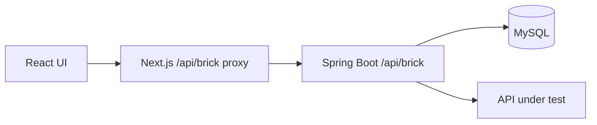

# Brick Platform Frontend

[](https://github.com/graham-gc/brick-platform-frontend/actions/workflows/ci.yml)

Brick Platform is a visual API workflow automation application. It turns imported Swagger/OpenAPI endpoints into executable test flows with response variables, request bindings, branching, assertions, test suites, and run diagnostics.

The Spring Boot service and complete local setup are available in [brick-platform-backend](https://github.com/graham-gc/brick-platform-backend).

## Features

- Import Swagger/OpenAPI documents from a URL or local JSON file
- Browse endpoint definitions, parameters, request bodies, responses, and recursively resolved schemas
- Compose flows on a drag-and-drop canvas and reuse the same endpoint multiple times
- Build branches with configurable `ALL` and `ANY` joins
- Extract JSON response fields using direct paths, indexes, filters, lists, or custom JSONPath expressions
- Bind flow variables to downstream body, query, path, and header fields
- Configure shared flow headers and node-specific headers
- Add status-code, JSONPath, response-header, and response-time assertions
- Run individual flows or ordered Test Suites and inspect transport and business outcomes separately
- Review node-level request, response, assertion, timing, and error details
- Correlate browser, proxy, and backend activity through `X-Request-ID`

## Technology

- Next.js 16 App Router and React 19
- TypeScript
- Ant Design 6
- React Flow (`@xyflow/react`)
- TanStack Query and Zustand

## Architecture

Browser-side requests use the local `/api/brick` route. The Next.js route handler acts as a small backend-for-frontend proxy, so the browser does not need direct cross-origin access to Spring Boot.



## Run locally

### Docker image

The production image uses Next.js standalone output and runs as a non-root user.

```bash
docker build -t brick-platform-frontend .
docker run --rm \
  -p 3000:3000 \
  -e API_BASE_URL=http://host.docker.internal:8080/api/brick \
  brick-platform-frontend
```

Open [http://localhost:3000](http://localhost:3000). The backend repository also provides a Docker Compose file that starts the frontend, backend, MySQL, and mock commerce API together.

### Local development

#### Prerequisites

- Node.js 20.9 or later
- npm
- A running [Brick Platform backend](https://github.com/graham-gc/brick-platform-backend)

#### Install and start

```bash
npm ci
API_BASE_URL=http://localhost:8080/api/brick npm run dev
```

Open [http://localhost:3000](http://localhost:3000).

`API_BASE_URL` is server-only and is not exposed to the browser. If omitted, it defaults to `http://localhost:8080/api/brick`.

## Quality checks

```bash
npm run lint
npm run build
```

GitHub Actions runs both checks for pushes to `main` and for pull requests.
It also builds the production container image to keep the Docker deployment path verified.

## Main routes

| Route | Purpose |
| --- | --- |
| `/mappings` | Swagger/OpenAPI source management and synchronisation |
| `/endpoints` | Endpoint and resolved-schema inspection |
| `/flows` | Flow management, visual design, and execution |
| `/test-suites` | Ordered multi-flow execution and reports |
| `/global-variables` | Reusable variable definitions |
| `/runs` | Flow run history and node-level diagnostics |

## Current scope

This is a portfolio reconstruction of an internal engineering-efficiency platform. It contains no former-employer source code, production data, infrastructure details, or proprietary identifiers. Authentication and multi-tenant access control are outside the current demonstration scope.
