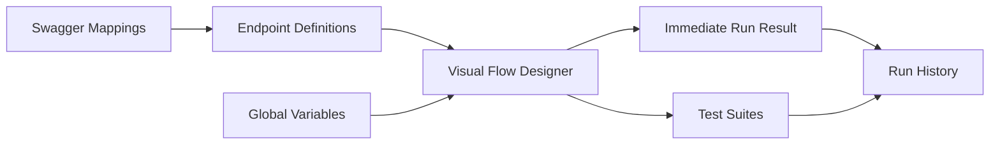
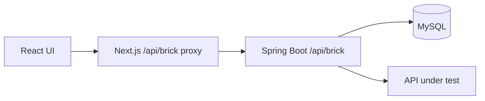

# Brick Platform Frontend

[](https://github.com/graham-gc/brick-platform-frontend/actions/workflows/ci.yml)

Brick Platform is a visual API workflow automation application. It converts imported Swagger/OpenAPI endpoints into executable test flows with response extraction, request binding, branching, assertions, reusable variables, test suites, and detailed run diagnostics.

This repository contains the Next.js application. The execution service, database schema, mock API, and complete Docker Compose setup are in [brick-platform-backend](https://github.com/graham-gc/brick-platform-backend).

## Project background

This is the user-interface reconstruction of an internal engineering-productivity platform that I independently designed and delivered. The original platform supported approximately 30 applications, 4,000 API definitions, and more than 800 test flows. The public implementation uses newly written code and synthetic data; it contains no former-employer source code, production data, infrastructure details, or proprietary identifiers.

The product problem was fragmented API scripts and repeated manual execution. The interface therefore focuses on helping users understand a contract, assemble existing endpoints into a workflow, transfer data without writing glue code, and diagnose the result from a single report.

The implementation reflects a full delivery lifecycle rather than a UI exercise: requirements are translated into explicit interaction rules, error states are designed for diagnosis, layouts adapt to different window sizes, and the public demo can be handed to another engineer without access to the original workplace.

## Core experience

### Import and inspect API contracts

- Validate and import Swagger 2.0 or OpenAPI 3 from a URL or local JSON file
- Browse endpoints by application, environment, version, method, and path
- Inspect request bodies, query parameters, path parameters, responses, and recursively resolved schemas

### Compose executable flows

- Drag endpoints from a searchable library onto a React Flow canvas
- Reuse the same endpoint multiple times as independent flow nodes
- Connect nodes through four bidirectional handles and build branching graphs
- Configure `ALL` or `ANY` join behaviour for nodes with multiple incoming dependencies
- Edit flow names inline and keep unsaved nodes distinct with temporary negative IDs

### Pass data through a workflow

- Extract response values with direct fields, array indexes, filters, lists, or custom JSONPath expressions
- Create flow-scoped variables from an upstream node and expose only valid variables to downstream nodes
- Bind variables into request bodies, query parameters, path parameters, and headers
- Configure inherited flow headers separately from node-specific headers
- Use static values, stored Cookie values, JavaScript functions, and backend-managed database queries through `${{...}}`

### Verify and diagnose results

- Configure status-code, JSONPath, response-header, and response-time assertions
- Distinguish request/transport success from business assertion success
- Open the current run result immediately after execution
- Inspect node request, response, assertion, duration, and error details in a full-width diagnostic view
- Run ordered Test Suites and review historical executions

## Interface structure



Browser requests use the local `/api/brick` route. Its Next.js route handler acts as a small backend-for-frontend proxy, so the browser does not need direct cross-origin access to Spring Boot and the backend address remains server-side.



## Interaction decisions

| Decision | User benefit |
| --- | --- |
| Show method and path prominently on node cards | Paths are more useful than long endpoint descriptions while composing a workflow. |
| Keep flow nodes independent from endpoint definitions | The same API can be configured and executed multiple times in one flow. |
| Generate temporary negative node IDs | Newly dragged nodes remain unique before the database assigns persistent IDs. |
| Derive binding targets from the selected endpoint schema | Users only see request areas and fields that actually exist. |
| Limit variable selection to reachable upstream nodes | A flow cannot silently reference data that will not exist when a node executes. |
| Open the current report immediately after a run | Users do not need to navigate manually to Run History to understand the outcome. |
| Use responsive tables and diagnostic drawers | Operational information remains usable across window sizes without fixed-width action columns. |

## Technology

- Next.js 16 App Router and React 19
- TypeScript
- Ant Design 6
- React Flow (`@xyflow/react`)
- TanStack Query
- Zustand
- ESLint, Docker, and GitHub Actions

## Quick start

For the complete environment, use Docker Compose from the [backend repository](https://github.com/graham-gc/brick-platform-backend):

```bash
git clone https://github.com/graham-gc/brick-platform-backend.git
cd brick-platform-backend
cp .env.example .env
docker compose up --build
```

Open [http://localhost:3000](http://localhost:3000).

## Local development

### Prerequisites

- Node.js 20.9 or later
- npm
- A running [Brick Platform backend](https://github.com/graham-gc/brick-platform-backend)

### Install and run

```bash
npm ci
API_BASE_URL=http://localhost:8080/api/brick npm run dev
```

`API_BASE_URL` is used only by the server-side proxy and is not exposed to the browser. It defaults to `http://localhost:8080/api/brick`.

### Production container

The production image uses Next.js standalone output and runs as a non-root user.

```bash
docker build -t brick-platform-frontend .
docker run --rm \
  -p 3000:3000 \
  -e API_BASE_URL=http://host.docker.internal:8080/api/brick \
  brick-platform-frontend
```

## Product walkthrough

1. Open **Swagger Mappings** and import `http://localhost:9090/openapi.json`.
2. Open **Endpoint Definitions** and inspect the generated request and response models.
3. Create a flow from **Test Flows**.
4. Compose `Login -> List Products -> Create Order -> Pay Order -> Get Order`.
5. Extract response variables and bind them to downstream headers, bodies, and paths.
6. Add assertions and run the flow.
7. Inspect the immediate result drawer, then open **Run History** for the persisted execution snapshot.
8. Add the flow to a **Test Suite** for ordered multi-flow execution.

The bundled mock login accepts `demo.user` / `demo-password`. Protected endpoints expect `Authorization: Bearer mock-access-token`.

## Main routes

| Route | Purpose |
| --- | --- |
| `/mappings` | Swagger/OpenAPI source management and synchronisation |
| `/endpoints` | Endpoint and recursively resolved schema inspection |
| `/flows` | Flow management, visual composition, and execution |
| `/test-suites` | Ordered multi-flow execution and reports |
| `/global-variables` | Static values, JavaScript functions, and database-query variables |
| `/runs` | Historical runs and node-level diagnostics |

## Quality checks

```bash
npm run lint
npm run build
```

GitHub Actions runs both checks and builds the production container image for pushes to `main` and pull requests.

## Repository layout

```text
src/app/(main)/             application pages
src/app/api/brick/          backend-for-frontend proxy
src/features/flow-designer/ canvas, nodes, variables, headers and assertions
src/features/run-result/    immediate and historical execution diagnostics
src/services/               typed backend API client
src/stores/                 shared client state
src/types/                  API and domain models
```

## Scope

The portfolio version focuses on workflow design, API contract handling, execution feedback, and engineering-productivity use cases. Authentication and multi-tenant administration are intentionally outside the demonstration scope.
